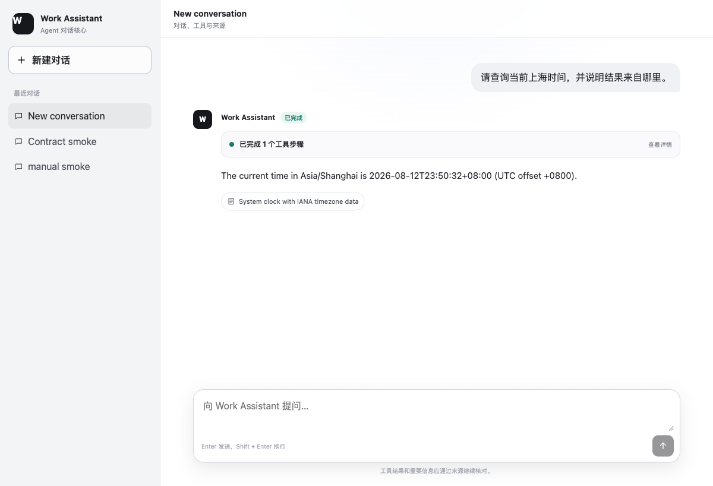

# Work Assistant Agent

Work Assistant Agent is a neutral, open-source Agent Host with a real employee
chat experience. It owns stable Thread, Run, Message, Event, Tool, cancellation,
replay, persistence, and subject-scoped ownership semantics while reusing
LangChain and LangGraph for the model/Tool loop.

The first vertical slice is deliberately small but complete: a user can ask for
the current time and follow up with other places in the same conversation. The
model uses a read-only time Tool once per Run, the UI streams stable product
events and sources, and PostgreSQL preserves every turn for refresh, history
switching, reconnect, and failure recovery.



## Stack

- React, TypeScript, and Vite
- FastAPI and Python 3.12
- LangChain `create_agent` and LangGraph
- DeepSeek as the first live provider, with a deterministic fake mode for tests
- PostgreSQL 17 for product state and Runtime checkpoints
- REST plus a stable server-sent event contract
- Docker Compose for local integration

## Quick start

The Compose path only requires Docker Compose:

```bash
cp .env.example .env
docker compose up --build
```

Open `http://localhost:5173`. The checked-in default uses deterministic fake
mode, no model credential, and the explicitly configured single-Principal
`anonymous` development identity. To use DeepSeek, set `MODEL_MODE=deepseek`
and provide `DEEPSEEK_API_KEY` only in a local ignored secret source.

Compose binds the database, API, and web UI to `127.0.0.1` only. Anonymous mode
is not a production identity system and must not be exposed to a LAN or the
public internet. The default server identity mode is `external`: a production
deployment must inject a real neutral `IdentityProvider`, and startup fails
closed if it does not. The public core defines no company login or token format.
See the
[`Principal and ownership contract`](docs/contracts/identity-and-ownership.md).

## Verification

Host-side verification additionally requires Python 3.12 with `uv`, Node 24,
and pnpm 11:

```bash
./scripts/verify.sh
```

The default verification does not read `.env` and does not call a model or
business service. A first dependency installation may access package registries;
use the committed lock files for reproducibility. Live DeepSeek and browser
acceptance are explicit lanes; neither is implied by a successful unit test.

With Compose running, exercise the persisted REST/SSE contract without printing
message content:

```bash
python3 scripts/compose_smoke.py
```

For the two-Principal ownership lane, start an isolated Compose project with the
development header provider and a deliberately slow fake Run so cancellation is
observable, then run the bounded identity smoke:

```bash
COMPOSE_DISABLE_ENV_FILE=1 APP_ENV=development \
  IDENTITY_PROVIDER_MODE=development_header MODEL_MODE=fake \
  FAKE_STEP_DELAY_SECONDS=1 \
  docker compose --env-file /dev/null -p work-assistant-t005-e3 up --build
python3 scripts/identity_compose_smoke.py
```

The smoke covers owner-filtered list/detail, independent same-key idempotency,
cross-subject denial, cancellation, retry, SSE `after_seq`, `Last-Event-ID`, and
re-authentication on reconnect. The development subject header is confined to
loopback tests; it is not placed in frontend configuration, URLs, browser
storage, product payloads, or smoke output.

Migration `0002_principal_ownership` requires a live database connection but an
exclusive application downtime window. It preserves v0.2 rows under an
unclaimable internal quarantine subject; it does not support offline `--sql`
generation or a non-empty downgrade to the unauthenticated schema.

The phase-2 smoke uses one Thread for Shanghai, London, and New York, deliberately
disconnects and resumes the first SSE stream, checks idempotent replay, and then
rebuilds all three Runs from the persisted Thread snapshot:

```bash
python3 scripts/phase2_compose_smoke.py conversation
```

For the redacted live-model lane, explicitly start Compose with a local secret,
independently confirm the effective provider/model inside the backend, and use
distinct evidence labels:

```bash
cp .env.example .env
# Edit the ignored .env locally: set MODEL_MODE=deepseek,
# DEEPSEEK_API_KEY, and DEEPSEEK_MODEL=deepseek-v4-flash.
docker compose up -d --force-recreate backend frontend
docker compose exec -T backend python -c \
  'from work_assistant.settings import get_settings; s=get_settings(); print(s.model_mode, s.deepseek_model)'
python3 scripts/phase2_compose_smoke.py conversation \
  --lane deepseek_multiturn_e4 --model deepseek-v4-flash
```

The CLI `--model` value is an operator-supplied redacted evidence label; the
container check above is the independent configuration proof. The smoke output
contains only that label, timings, event types, counts, and boolean contract
checks, never the credential, answers, Tool output, or exception details.

To exercise hard-restart recovery, start a long fake Run, record the bounded
IDs printed by `restart-create`, kill only the backend, restart it without
deleting the PostgreSQL volume, and then verify the old and retry Runs:

```bash
FAKE_STEP_DELAY_SECONDS=10 docker compose up -d --force-recreate backend
python3 scripts/phase2_compose_smoke.py restart-create
docker compose kill -s SIGKILL backend
FAKE_STEP_DELAY_SECONDS=0.02 docker compose up -d --no-deps backend
python3 scripts/phase2_compose_smoke.py restart-verify \
  --thread-id '<thread_id>' --run-id '<run_id>'
```

With `FAKE_STEP_DELAY_SECONDS=2` on the backend, the PostgreSQL concurrency
smoke verifies 20 duplicate idempotency requests and 10 competing active Runs:

```bash
python3 scripts/postgres_concurrency_smoke.py
```

The included Compose topology is a single execution instance. On startup it
closes orphaned active Runs as `service_restarted`; a multi-replica deployment
must add explicit Run ownership before using that startup sweep.

The public-core Stage 3 milestone is intentionally split into four independently
accepted slices: principal and ownership safety, the Agent policy kernel,
controlled neutral Skill/MCP extension, and one downstream assembly and release
path. This repository does not treat a standalone neutral MCP fixture as Host
integration or Stage 3 acceptance evidence.

## Public/private boundary

This repository contains no company adapters or private deployment material.
Downstream private integrations may depend on a released public version. This
repository never depends on those private integrations.

Third-party packages remain under their own licenses. The lockfile-based
inventory and distribution notes are recorded in
[`THIRD_PARTY_LICENSES.md`](THIRD_PARTY_LICENSES.md).

Licensed under the MIT License.
